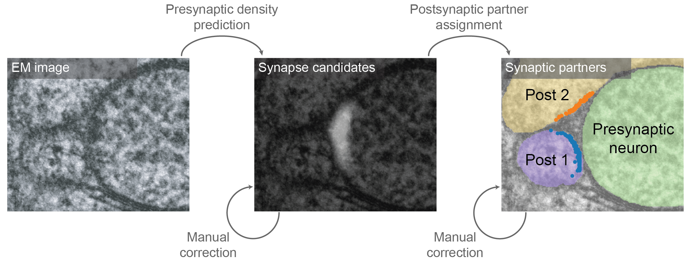

# Cnapse: Semi-automated synapse detection in *C*. *elegans* EM images

*Cnapse* is a tool that enables semi-automated synapse detection in *C*. *elegans* electron microscopy (EM) images. *Cnapse* is designed to detect only chemical synapses as these synapses have clear visual features in EM images such as synaptic vesicles and dark regions near the presynaptic membrane.



*Cnapse* takes raw EM image as an input and use trained convolutional neural network (CNN) to detect the synapse candidates. Then, synaptic partners are assigned by running Monte Carlo simulation of neurotransmitters (Witvliet et al. 2021) and the size of the synaptic connections are determined by the proportion of neurotransmitters.

## Synaptic partner assignment
```
synapse_diffuse.py --syn_seg [syn_seg.tif] --cell_seg [cell_seg.tif] --mip [mip] --outpath [outpath.csv]
```
- `syn_seg` : Synpase segmentation volume
- `cell_seg` : Cell segmentation volume
- `syn_info` : List of presynaptic density ids with assigned presynaptic cell ids
- `mip` : Mip level of the volumes (2^[mip] nm resolution)
- `outpath` : Path to save result

## References
Witvliet, Daniel, Ben Mulcahy, James K. Mitchell, Yaron Meirovitch, Daniel R. Berger, Yuelong Wu, Yufang Liu, et al. 2021. “Connectomes across Development Reveal Principles of Brain Maturation.” Nature 596 (7871): 257–61.
